# Una breve historia del tiempo

[@iagolast](twitter.com/iagolast)

# www.TimeTime.in

<!--
Hola me llamo iago lastra, soy desarrolldor frontend desde hace más de una década y desde enero de 2023 soy tambien cofundador de TimeTime.in, una empresa de la que hare publicidad más adelante. Por ahora basta que sepáis que nos dedicamos a hacer software relacionado con calendarios.

Lo primero de todo. ¿Cuanta gente sabe programar? Por favor levantaros y así hacemos el típico ejercicio para oxigenaros y captar vuestra atención.
 -->

---

# Temporal

<!--
Bien, por si no lo sabíais el TC39, que es el comité de sabios que decide la evolución de Ecmascript esta trabajando en una nueva API llamada "Temporal" para manejar fechas y horas.
Como podeis ver, entre sus principios esta el poder representar fechas en calendarios locales convertibles a calendario gregorian proleptico. Usar un reloj estandard de 24h y no representar los segundos intercalares.

Supongo que en este punto os estaréis preguntando que carallo os estoy contando. Pues bien, el objetivo de esta charla es doble, por un lado os voy a dar una introducción a la historia de la medición del tiempo y por otro os voy a explicar los problemas que soluciona esta API


-->

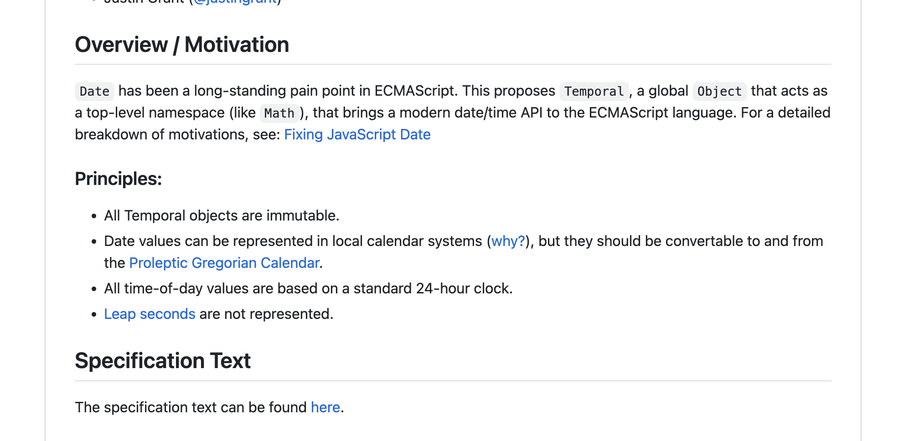

---

# Calendario

<!--

Empezamos por el principio. El calendario. El calendario no es más que es una herramienta que nos permite organizar y medir el paso el tiempo y como todas las herramientas ha ido evolucionando a medida que cambiaban nuestras necesidades.

Aunque pueda parecer sencillo medir el tiempo es algo tremendamente complejo. Si hay algo con lo que quiero que os quedeis de mi charla es con eso.

En principio, para medir el tiempo simplemente tenemos que buscar un evento que suceda de forma periódica y contarlo.


 -->

---

# ~10.0000 AC

- Calendarios lunares
- Ciclos de 29.53 días
  - 365 / 29 = 12.58
  - 365 / 30 = 12.16

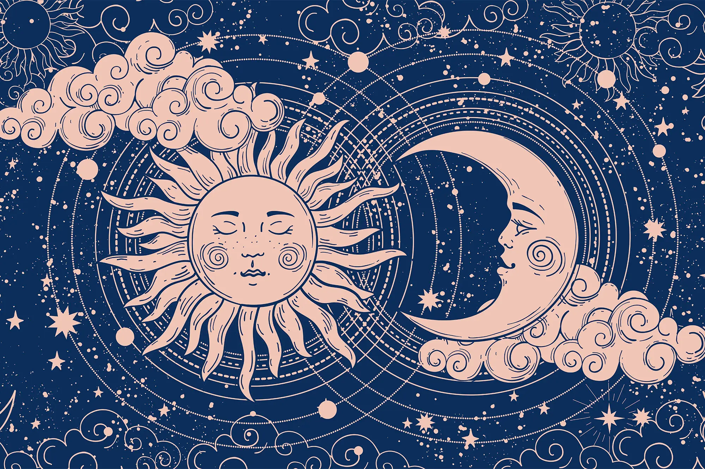

<!--

Los primeros calendarios se basaban en los movimientos periódicos del sol y de la luna para medir el paso del tiempo.

Como sabeis el sol sale cada día y la luna tiene un ciclo de 29-30 días. por lo que podemos imaginarnos a unos humanos primitivos diciendo "la cosecha germinará dentro de 2 lunas" o "mi casa está a una luna y 3 soles caminando en esa dirección".

Este sistema funcionaba "bien" en las primeras sociedades humanas pero tenia un problema importante y es que el ciclo lunar no es un divisor exacto del ciclo solar ni los días son divisores exactos de los ciclos lunares. Esto hace que predecir las estaciones basándonos únicamente en el ciclo lunar sea terríblemente complejo.

Para predecir las estaciones con precisión necesitamos usar el sol y las estrellas y así conocer en qué momento del año estamos.


-->

---

# 2000 AC

Calendario luni-solar

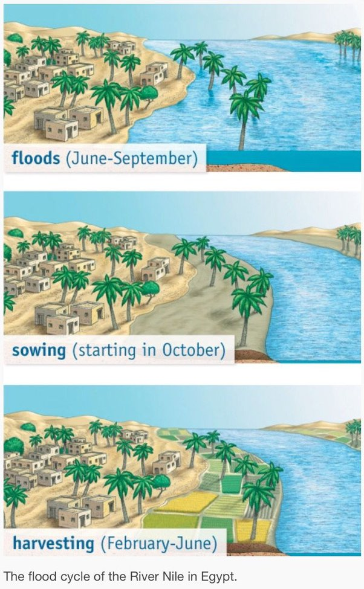

<!--

Resulta que en el norte de áfrica apareció una civilización cuya supervivencia dependía en gran parte de predecir correctamente las crecidas y decrecidas del río Nilo.

-->

---


<!--

Por ello los egipcios fueron de las primeras civilizaciones en crear un calendario lunisolar. Su calendario tenía 12 meses de 30 días y 5 días sueltos al final del año para cuadrar las estaciones.

 -->

---

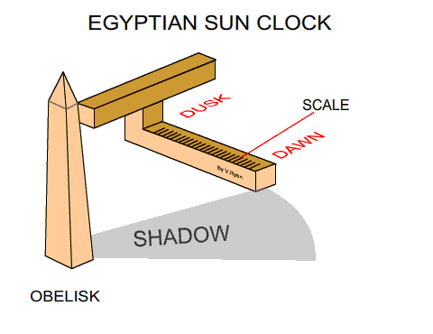

<!--

Además los Egipcios también fueron pioneros en medir el tiempo a escalas mas pequeñas. Tenian relojes de sol, donde se dividía una superficie en 12 partes y se veía la sombra de un monolíto en ella.

-->

---

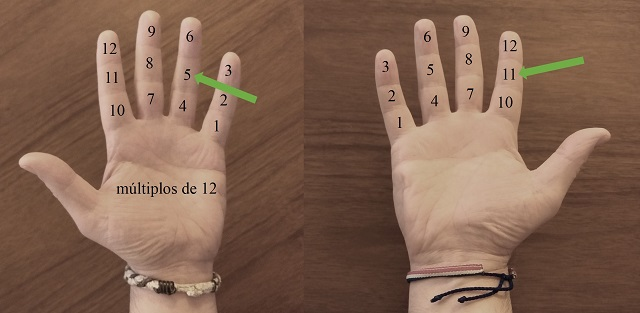

<!--

¿Por que 12 partes? Pues porque los egipcios estaban influenciados por la civilización sumeria, que utilizaba un sistema base 12 para contar.

-->

---


<!--

Como dato curioso, decir que la dirección de las agujas del reloj es la que es, porque es la dirección que sigue la sombra del sol en el hemisferio norte.

 -->

---

# 45 AC

Calendario Juliano


<!--

Y llegamos al año 45 antes de Cristo. Julio César y Cleopatra se anexionan Egipto al imperio romano y César queda tan sorprendido
por la calidad del calendario egipcio que encarga a un equípo de astrónomos liderados por un tal Sosigenes un calendario similar para Roma.


Y el tio lo clava, crea un calendario que acumula un error de 11 minutos al año. Menos de dos segundos por día.
 -->

---

1. `Martius (31)`: Mes de Marte, dios de la guerra.
2. `Aprilis (30)`: (del verbo aperire) mes de apertura de flores.
3. `Maius (31)`: Mes de Maia
4. `Junius (30)`: Mes de Juno (diosa del matrimonio)
5. `Quintilis (31)`: Mes quinto
6. `Sextilis (30)`: Mes sexto
7. `September (31)`: Mes séptimo
8. `October (30)`: Mes octavo
9. `November (31)`: Mes noveno
10. `December (30)`: Mes décimo
11. `Januarius (31)`: Mes de Jano, dios de los comienzos y finales.
12. `Februarius (29)`: Mes de las hogueras y la purificacion. (Bisiesto cada 4 años)

<!--

Propone un calendario con meses de duraciones alternas, 30 / 31 y un mes final de 29 días.
Sumando un total de

 -->

---

1. `Januarius (31)`: Mes de Jano, dios de los comienzos y finales.
2. `Februarius (28)`: Mes de las hogueras y la purificacion.
3. `Martius (31)`: Mes de Marte, dios de la guerra.
4. `Aprilis (30)`: (del verbo aperire) mes de apertura de flores.
5. `Maius (31)`: Mes de Maia
6. `Junius (30)`: Mes de Juno (diosa del matrimonio)
7. `JULIO (Quintilis) (31)`: Mes de Julio Cesar
8. `AGOSTO (Sextilis)(31)`: Mes Cesar Augusto
9. `September (31)`: Mes séptimo
10. `October (30)`: Mes octavo
11. `November (31)`: Mes noveno
12. `December (30)`: Mes décimo

---

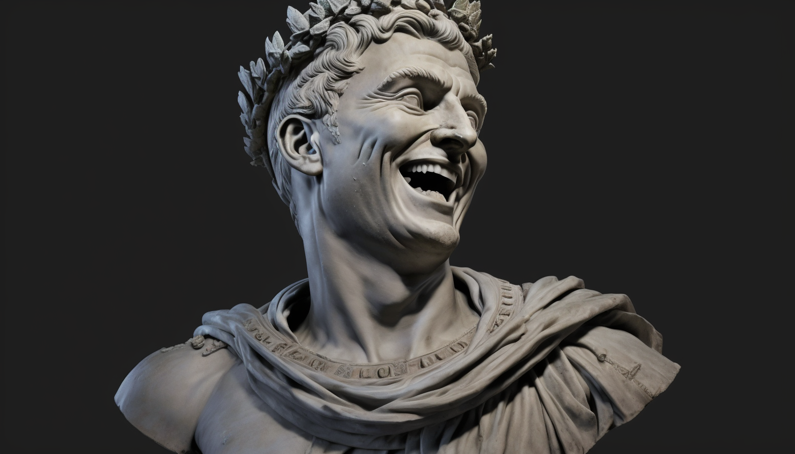

---

- **Domingo:** Dia del Sol _(sunday)_
- **Lunes**: Día de la luna
- **Martes** Dia de Marte
- **Miércoles:** Dia de Mercurio
- **Jueves:** Dia de Júpiter
- **Viernes:** Dia de Venus
- **Sábado:** Dia de Saturno _(saturday)_

<!--

De los romanos también heredamos los nombres de los días de la semana. Originalmente dedicados a los 7 astros visibles a simple vista.

(7 días es apróximadamente el tiempo que tarda la luna en pasar por cada una de sus fases)

 -->

---

# 1582

Calendario Gregoriano.

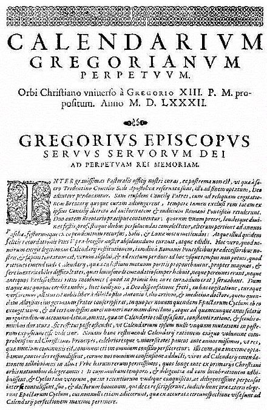

<!--

Y llegamos al año 1582. Recordad que os dije que el calendario juliano acumulaba un error de 11 minutos al año. Este error hizo que 1500 años más tarde los cristianos celebrasen la pascua 10 días antes de lo que deberían con el correspondiente descojone de las otras religiones.

Para poner remedio a esta situación el papa Gregorio XIII encarga una reforma del calendario que corrija este desfase.


  -->

---

<!-- footer: https://www.youtube.com/watch?v=LO5cLQAvtXg -->

- **AÑO SOLAR:**
  - 365.2422 días solares.
- **AÑO JULIANO** (365 dias + 1 dia bisiesto cada 4 años)
  - 365,25 días
  - ~11m extra cada año
- **AÑO GREGORIANO** 365 dias + 1 año bisiesto cada x años.
  - 365,2425 días
  - ~26s extra cada año

<!--


-->

---

<!-- footer: "" -->

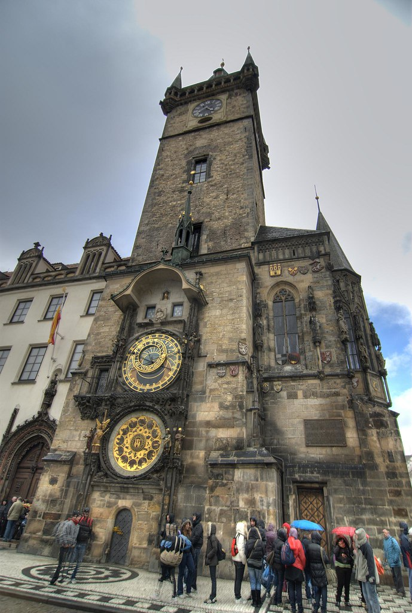

<!--

Y durante los siguiente años todo fue maravilloso. Teniamos un calendario preciso que medía años meses semanas y días y incluso teníamos relojes que funcionaban por la noche. Eso si, eran tan complejos que había que construir un edificio para alojarlos.

-->

---

# 1830s

Se populariza el ferrocarril.


<!--

Hasta que en el siglo XIX aparece el tren!

El tren revolucionó completamente la percepción que el ser humano tenía de las distancias y del tiempo.

Un viaje que antes llevaba días, ahora se podía hacer en horas.

 -->

---


---

<!-- footer: https://www.youtube.com/watch?v=NFLb1IPlY_k -->

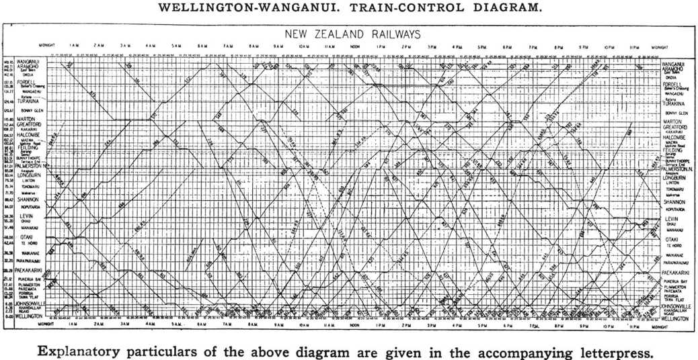

---

<!-- footer: "" -->

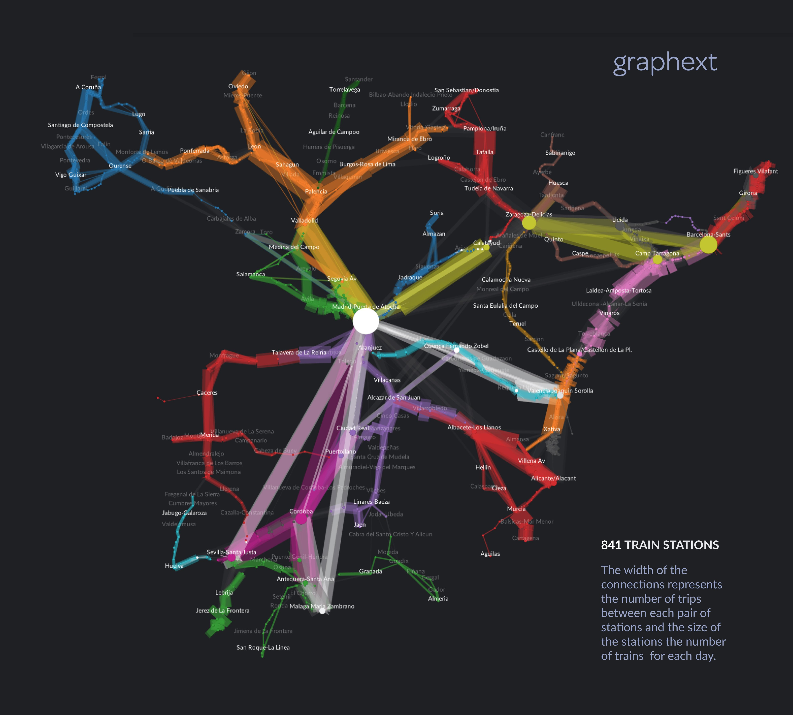

<!--

Ahora vamos a volver al colegio. Si un tren sale de Barcelona a las 12:00 y otro tren sale a las 12:30 de santiago de compostela. ¿A que hora se cruzan asumiendo a una velocidad constante de 100km/h ?

 -->

---

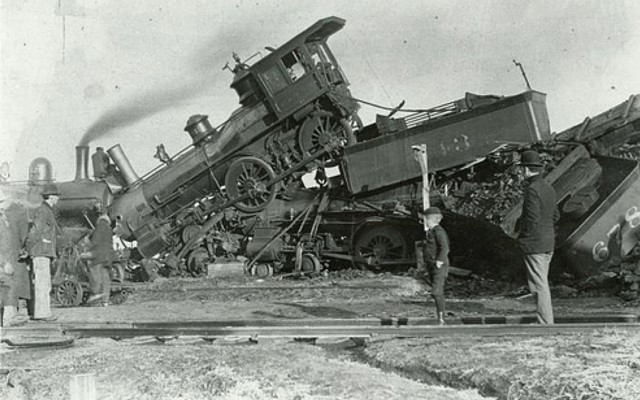

---

<!--

En noviembre de 1840 la compañía Great Western Railway estableció como tiempo estándar en todas sus estaciones la hora marcada por el Real Observatorio de Greenwich y no fue hasta 1880 cuando todo reino unido adoptó una hora estandard basada en el horario de ferrocarril.

 -->

# 1840

Se establece la hora de Greenwich en los trenes.

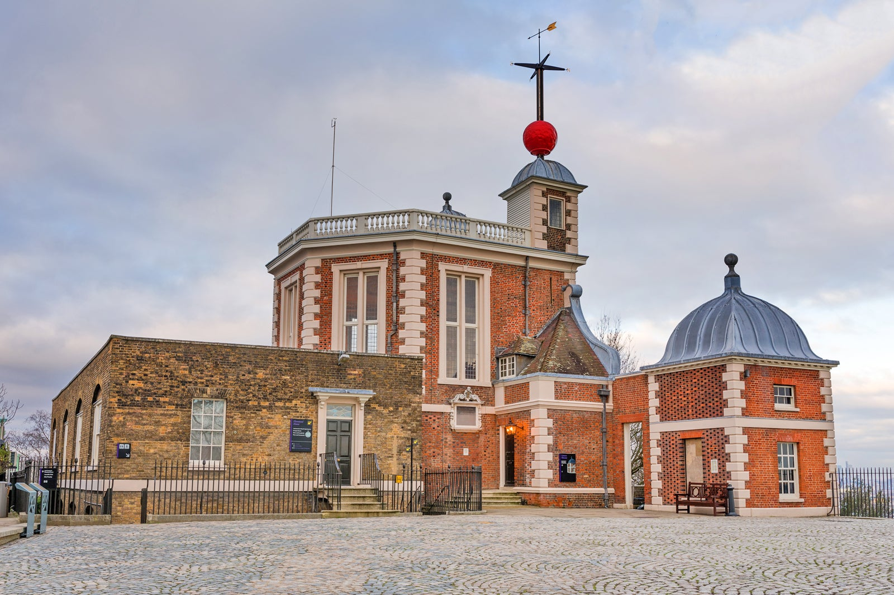

---

# 1880

Se establece una zona horaria única en todo el reino unido.

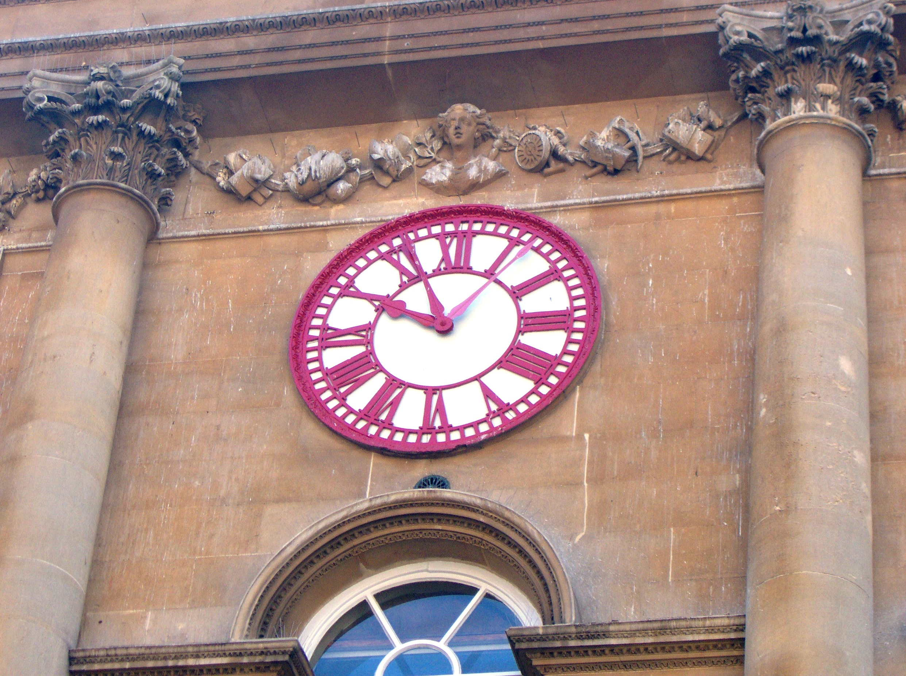

<!--

Aunque hoy pueda parecer normal, hubo mucha resistencia y en lugares como la bolsa de bristol se puede ver un reloj que todavía conserva dos manecillas, una con la hora local y la hora de GMT.

 -->

---

# 1884

Se establece el meridiano de Greenwich como meridiano de referencia.

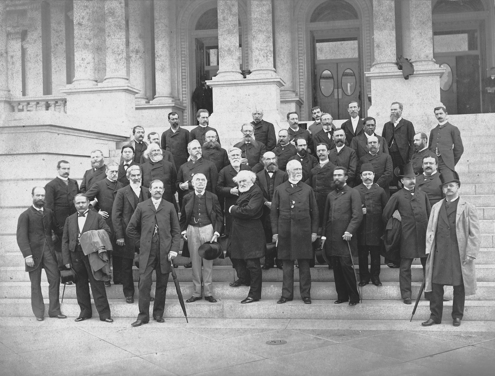

<!--

En octubre de 1884 se celebra la conferencia internacional del meridiano, donde a grandes rasgos se acuerda que "para las cosas tecnicas" establecer un tiempo de referencia basado en la hora media en el meridiano de Greenwich (GMT).

Se propone la utilización de diferentes husos horarios

https://es.wikipedia.org/wiki/Hora_media_de_Greenwich
 -->

---

# 1912

Primera confernecia internacional de la hora.

Se establecen 24 husos horarios.

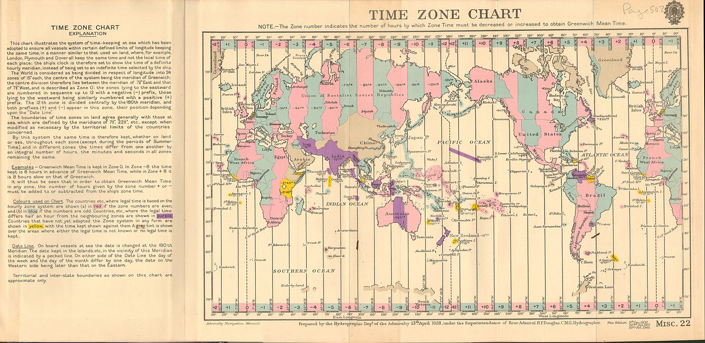

<!--
En 1912, se realiza la Conferencia internacional de la hora en París con la presencia de representantes de 25 naciones. En ella se acuerda el sistema de husos horarios presentado en la conferencia de 1884.26​27​ y se crea la Oficina internacional de la hora.
 -->

---

# 1948\*

Reloj atómico

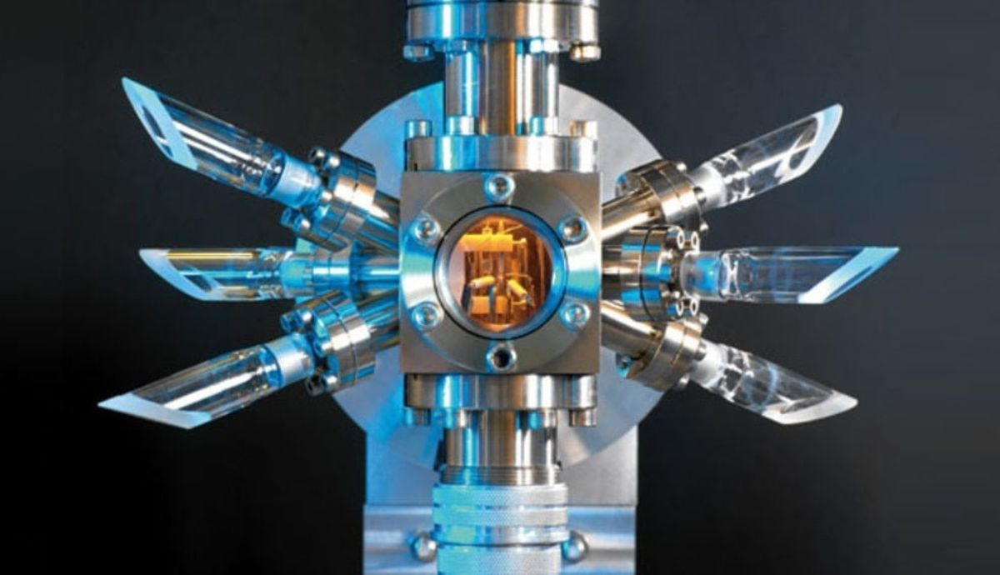

<!--

Y así llegamos a década de los 50, cuando el reloj atómico está suficientemente maduro como para iniciar una nueva revolución en la forma de medir el tiempo.

Tenemos un sistema de referencia que no depende de la rotación de la tierra, sino de la frecuencia de oscilación de un átomo.

 -->

---

# 1958

Origen del Tiempo Atómico Internacional (TAI)

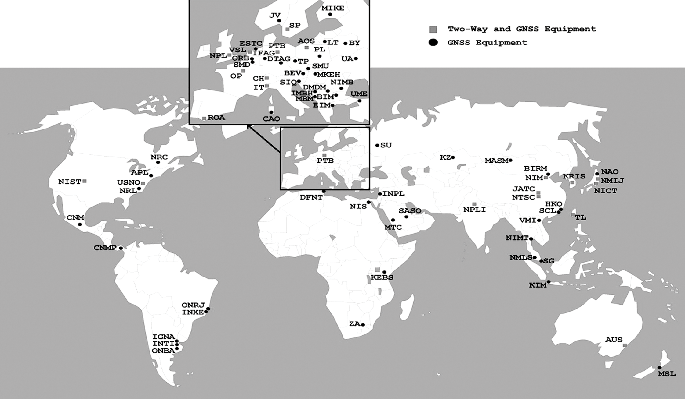

<!--

Esto hizo que los físicos sustituyesen a los astrónomos en su rol de guardianes del tiempo. Y crearon su propia escala de tiempo, El tiempo Atomico universal.

Calculado a partir de la frecuencia de oscilación de una serie de relojes atómicos que se encuentran repartidos por todo el mundo.

https://aviation.stackexchange.com/questions/90839/what-are-satellite-time-gps-time-and-utc-time

 -->

---

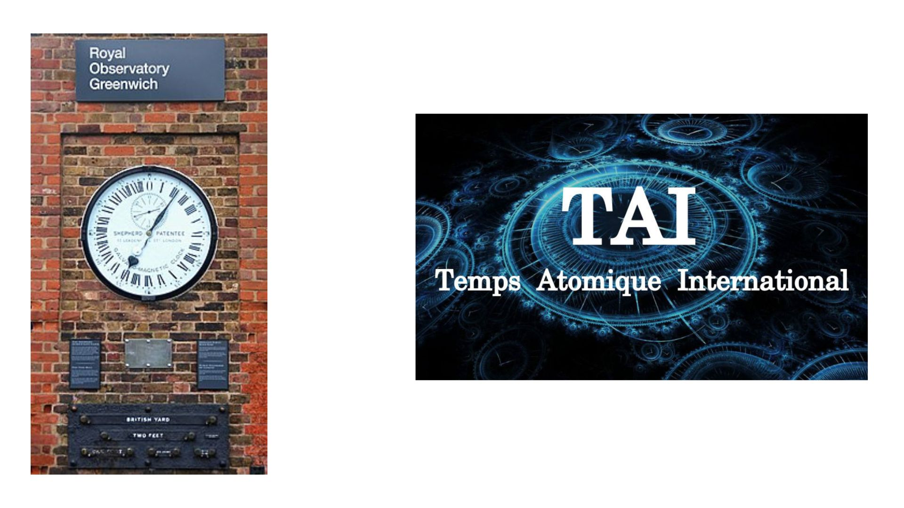

<!--

Asi que tenemos dos mecanismos para medir el tiempo.

Un tiempo astronómico, basado en la rotación de la tierra y en la posición de las estrellas. Y un tiempo atómico, basado en las frecuencias de oscilación.

-->

---

# 1970

$UTC_{s} = TAI_{s} - L_{s}$

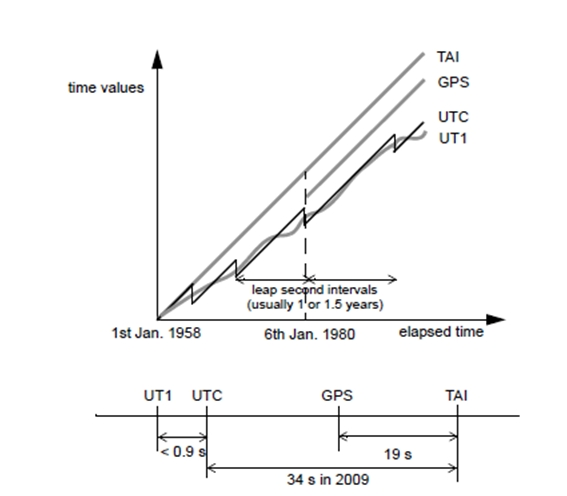

<!--
Como la rotación de la tierra no es constante, en 1970 se crea el tiempo UTC.

El tiempo universal coordinado es el tiempo atómico internacional más un ajuste para compensar estos cambios. Este ajuste consiste en añadir o restar los llamados segundos intercalares.

Por lo tanto UTC se va desviando de el Tiempo atómico internacional cada vez más.
-->

---

# Hoy

Múltiples sistemas temporales de referencia.

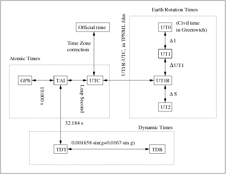

<!-- footer: https://gssc.esa.int/navipedia/index.php/Transformations_between_Time_Systems -->

---

# Hoy II

https://www.ucolick.org/~sla/leapsecs/timescales.html

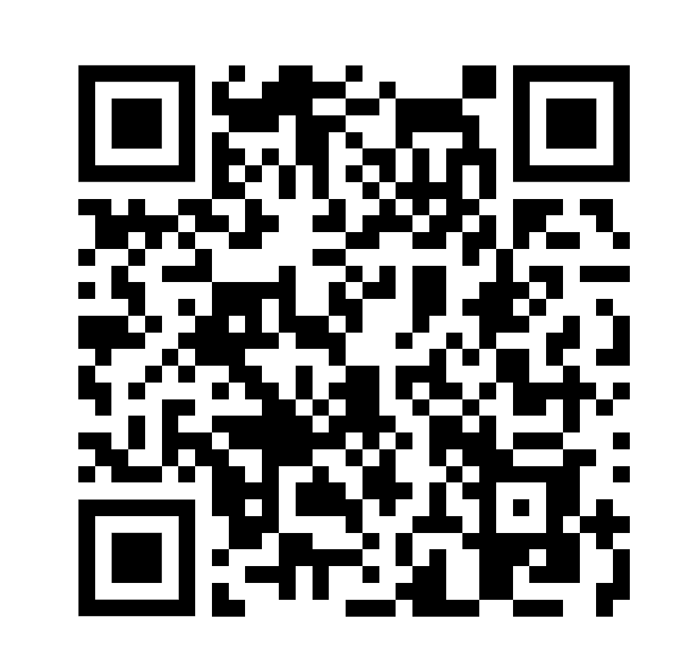

<!-- footer: https://www.ucolick.org/~sla/leapsecs/timescales.html -->

---

# POSIX TIME

<!--

De todas las escalas de tiempo, la que nos interesa como programadores es POSIX.

El sistema POSIX es el sistema de tiempo que usan la mayoría de los sistemas operativos modernos. Es también el sistema de tiempo que utiliza javascritpt.

POSIX se define como "el número de segundos transcurridos desde el 1 de enero de 1970 a las 00:00:00 UTC, sin incluir segundos intercalares".

POSIX no está pensado para ser preciso, está pensado para que sea sencillo operar con fechas al asumir que todos los días tienen una duración fija.

-->

> The number of non-leap seconds which have passed since 00:00:00 UTC on Thursday, 1 January 1970

<!-- footer: 'https://en.wikipedia.org/wiki/Unix_time' -->

---

<!-- footer: https://www.shalen.dev/blog/gnss-time -->

# POSIX

<style>
table {
  font-size: 29px;
}
table td {
  font-family: monospace;
}
</style>

| UTC      | TAI      | UTC (s)   | POSIX (step)   | POSIX (smear) |
| -------- | -------- | --------- | -------------- | ------------- |
| 23:59:58 | ......16 | 315619216 | 315619198.[00] | 315619197.75  |
| 23:59:59 | ......17 | 315619217 | 315619199.[75] | 315619198.50  |
| 23:59:60 | ......18 | 315619218 | 315619199.[25] | 315619199.25  |
| 00:00:00 | ......19 | 315619219 | 315619200.[00] | 315619200.00  |

---

<!--

Evidentemente esto de asumir que todos los dias tienen el mismo número segundos, es un problema, especialmente cuando se añaden segundos intercalares.

 -->

# JS

<!-- footer: https://www.mail-archive.com/leapsecs@rom.usno.navy.mil/msg00109.html -->

Fechas **POSIX**

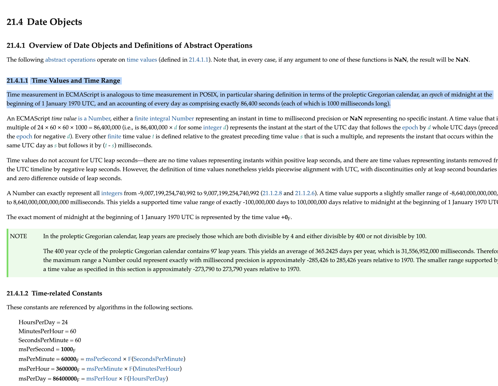

<!-- footer: '' -->

---

# Parte II

## Asumiendo que no necesitamos tanta precisión...

---

# ZONAS HORARIAS

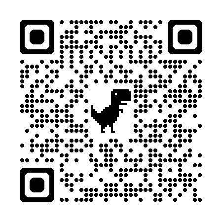

<!-- footer: 'https://www.youtube.com/watch?v=-5wpm-gesOY' -->

---

# Las fechas son INSTANTES

```ts
// Construir una fecha (LOCAL POR DEFECTO)
const birthDate = new Date(1992, 09, 13);

// Internamente se transforma en un número de milisegundos.
date.getTime(); // 718930800000

// Según lo visto se puede convertir a una fecha ISO
date.toISOString(); // '1992-10-12T23:00:00.000Z'
```

<!-- footer: '' -->

---

# Zonas horarias

- Importantes en cliente

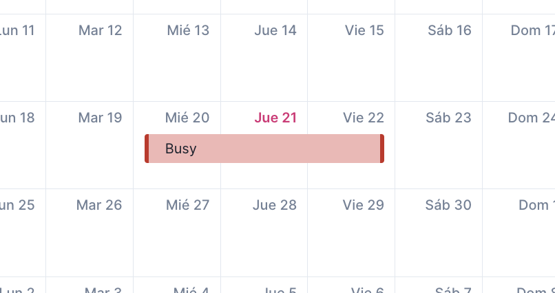

---

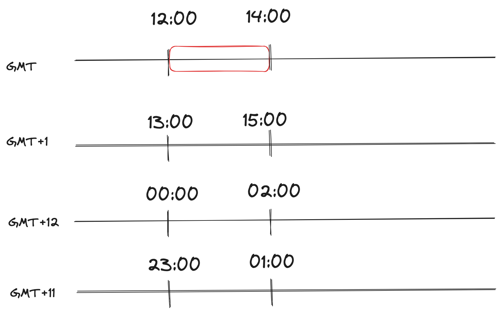

---

# Creando una cita médica

## 👎 Guardar fechas ISO

| start                | end                  |
| -------------------- | -------------------- |
| 2021-10-13T10:00:00Z | 2021-10-13T11:00:00Z |

---

# Creando una cita médica

## 👎 Guardar fechas ISO + Timezone offset

<style>
table {
  width: 100%;
  font-size: 30px;
}
table td {
  font-family: monospace;
}
</style>

| start                     | end                       |
| ------------------------- | ------------------------- |
| 2021-10-13T08:00:00+02:00 | 2021-10-11T10:00:00+02:00 |

---

# Creando una cita médica

## 👌 Guardar fechas ISO + Zona Horaria

<style>
table {
  width: 100%;
  font-size: 22px;
}
table td {
  font-family: monospace;
}
</style>

| start                                    | end                                      |
| ---------------------------------------- | ---------------------------------------- |
| 2021-10-13T08:00:00+02:00[Europe/Madrid] | 2021-10-11T10:00:00+02:00[Europe/Madrid] |

---

# Mañana

Temporal API
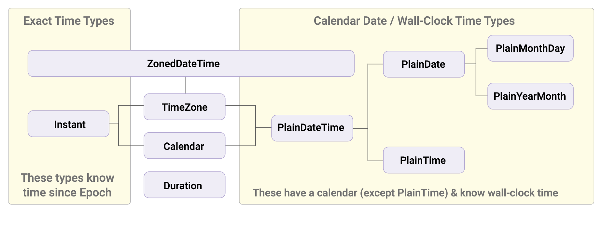

## <!-- footer: '' -->

---

# Graciñas

iago@timetime.in
[@iagolast](twitter.com/iagolast)
