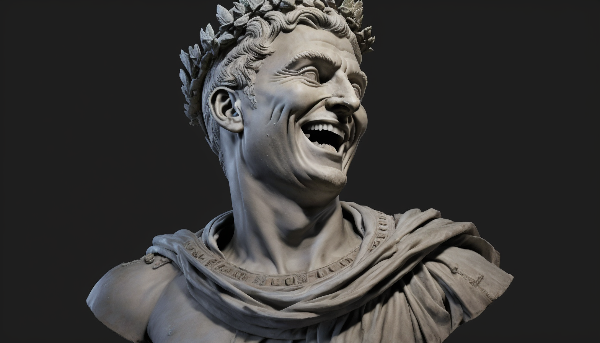
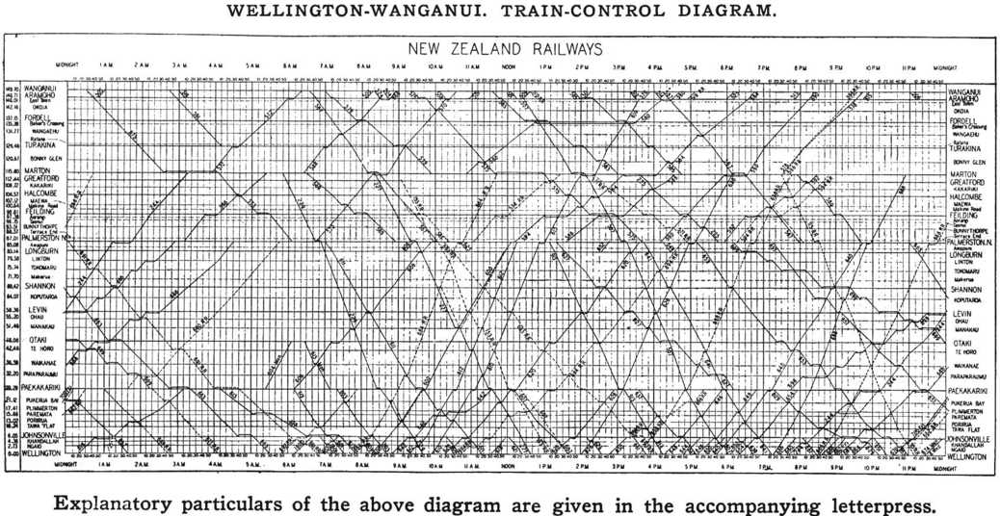
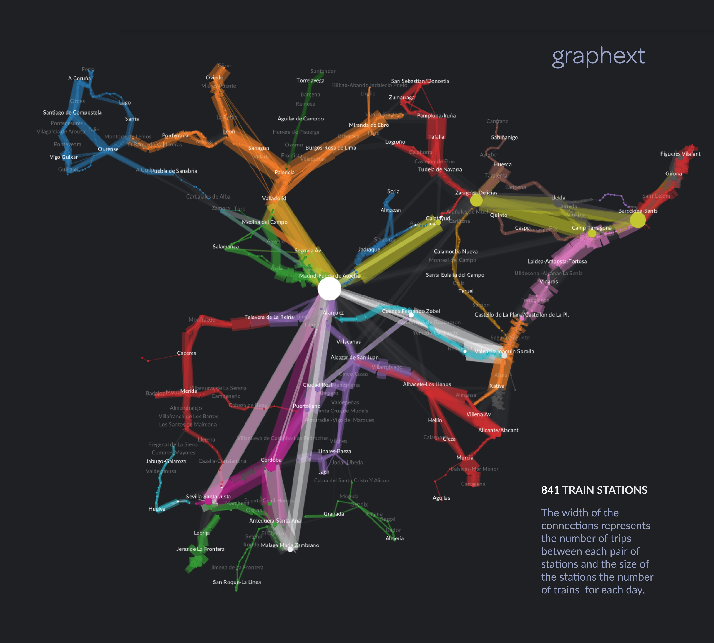
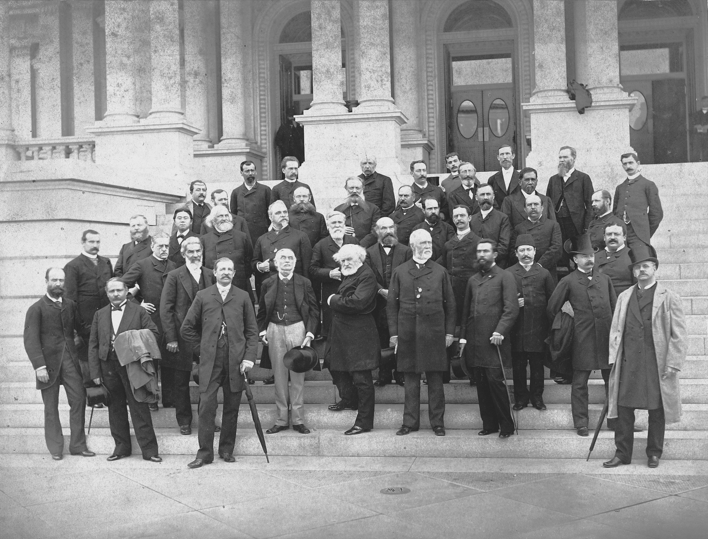
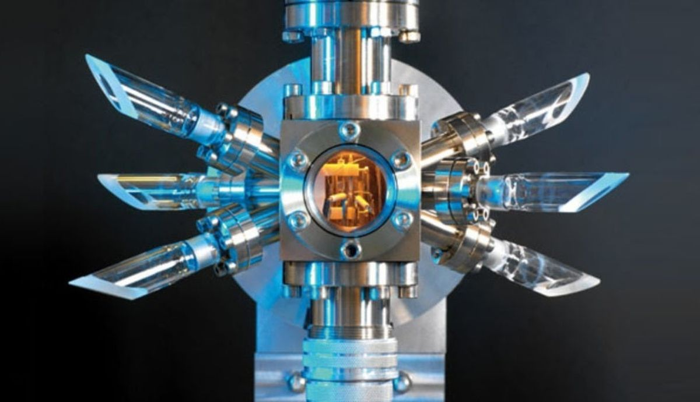
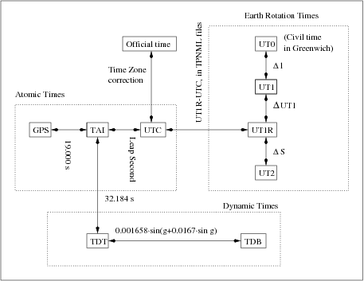

# A Brief History of Time

#### [@iagolast](twitter.com/iagolast)

#### www.timetime.in

<!--

Hello, my name is Iago and I have been a frontend developer for over 10 years, and since last year, Im also co-founder at TimeTime.in.

I'll share more about that later; for now, let me just say that we specialize in developing software related to time and calendars.

-->

---

# Temporal


<!--

Alright, for those who might not be aware, the TC39 is the group of people guiding evolution of javascript is currently working on a new API named "Temporal".

As you can see on of its core principles is: The ability to represent dates in local calendars that can be converted to the proleptic Gregorian calendar. It utilizes a standard 24-hour clock and does not account for leap seconds.

At this point, you might be wondering what exactly I'm talking about. Well, those are the goals of this talk, I will provide you with an introduction to the history of timekeeping and I will explain the problems that this API solves.

---

-->

---

# Calendar


<!--

So lets start from the beginning. The calendar. The calendar is just a tool which allows us to measure and organize time. As every tool the calendar has evolved among time.

Measuring time can look like an easy task but in reality it is a very very complex task.

One of the key points of this talk is that!

Basically, one easy way to to measure time is to look for a periodic event and count it.


 -->

---

# ~10.0000 BC

## 🌔 Lunar calendars

### Moon cycle:

- 27.32 solar days

### Solar year:

- 365.`2422` solar days.


<!--

First calendars used the periodic movement of the sun and the moon to measure time.


As you know, the sun rises every day, and the moon has a cycle of 29-30 days. So, we can imagine primitive humans saying, "the harvest will germinate in 2 moons," or "my house is a moon and 3 suns walking in that direction."

This system worked "well" in the earliest human societies but had a significant problem: the lunar cycle is not an exact divisor of the solar cycle, nor are the days exact divisors of the lunar cycles. This makes predicting the seasons based solely on the lunar cycle terribly complex.

To predict the seasons accurately, we need to use the sun and the stars, thus knowing at what time of the year we are.


-->

---

# ~2000 AC

## 🌔🌞 Calendar

- 12 months of 30 days
- Extra days (5)


<!--

But in the north of africa appeared a civilization which was totally dependent on predicting correctly how the Nile river was going to behave.

For this reason, the Egyptians were among the first civilizations to create a lunisolar calendar. Their calendar had 12 months of 30 days and 5 extra days at the end of the year to align the seasons.


-->

---

# 45 BC

Julian calendar


<!--

Year 45 BC. Julius Caesar conquered Egypt to the Roman Empire, and Caesar is so impressed by the quality of the Egyptian calendar that he commissions a team of astronomers led by someone named Sosigenes to create a similar calendar for Rome.

And the guy nails it, creating a calendar that accumulates an error of 11 minutes per year. Less than two seconds per day.
 -->

---

1. `Martius (31)`: Month of Mars, god of war.
2. `Aprilis (30)`: (from the verb _aperire_) month of flower opening.
3. `Maius (31)`: Month of Maia.
4. `Junius (30)`: Month of Juno (goddess of marriage).
5. `Quintilis (31)`: Fifth month.
6. `Sextilis (30)`: Sixth month.
7. `September (31)`: Seventh month.
8. `October (30)`: Eighth month.
9. `November (31)`: Ninth month.
10. `December (30)`: Tenth month.
11. `Januarius (31)`: Month of Janus, god of beginnings and endings.
12. `Februarius (29)`: Month of bonfires and purification. (Leap year every 4 years)

<!--

footer: 365.25 days ~ 365 + 366 days every 4 years

 -->

---

1. `Januarius (31)`: Month of Janus, god of beginnings and endings.
2. `Februarius (28)`: Month of bonfires and purification.
3. `Martius (31)`: Month of Mars, god of war.
4. `Aprilis (30)`: (from the verb _aperire_) month of flower opening.
5. `Maius (31)`: Month of Maia.
6. `Junius (30)`: Month of Juno (goddess of marriage).
7. `JULY (Quintilis) (31)`: Month of Julius Caesar.`
8. `AUGUST (Sextilis)(31)`: Month of Caesar Augustus.
9. `September (31)`: Seventh month.
10. `October (30)`: Eighth month.
11. `November (31)`: Ninth month.
12. `December (30)`: Tenth month.

<!-- footer: '' -->

---



---

# 1582

- Error of 10 days
- Gregorian Calendar


<!--

And we arrive at the year 1582. Remember I told you that the Julian calendar had an error of 11 minutes per year. This mistake led Christians to celebrate Easter 10 days earlier than they should have.

Because of this, other religions were mocking them and to fix this situation, Pope Gregory XIII ordered a calendar reform to correct this discrepancy.

  -->

---

<!-- footer: https://www.youtube.com/watch?v=LO5cLQAvtXg -->

# Summary

- **SOLAR YEAR:**
  - 365.2422 solar days.
- **JULIAN YEAR** (365 days + 1 leap day every 4 years)
  - 365.25 days. ~11 extra minutes each year
- **GREGORIAN YEAR** (365 days + 1 leap year every x years)
  - 365.2425 days. ~26 extra seconds each year

<!--


-->

---

<!-- footer: "" -->


<!--

And for the following years, everything was prefect. We had a precise calendar that measured years, months, weeks, and days, and we even had clocks that worked at night. However, they were so complex that we had to build a building to house them.

-->

---

# 1830s

Trains become mainstream


<!--

Then the train appeared and completely changed the way humans perceived distances and time.

A journey that used to take days could now be completed in hours.

 -->

---


---

<!-- footer: https://www.youtube.com/watch?v=NFLb1IPlY_k -->



---

<!-- footer: "" -->



<!--

Ahora vamos a volver al colegio. Si un tren sale de Barcelona a las 12:00 y otro tren sale a las 12:30 de santiago de compostela. ¿A que hora se cruzan asumiendo a una velocidad constante de 100km/h ?

 -->

---


---

# 1840

Greenwich time is set as the official time in all stations.


<!--

In November 1840, the Great Western Railway company decided to standarize time all its stations and they decided to use the time indicated by the Royal Observatory in Greenwich.


 -->

---

# 1880

A single time zone in UK


<!--

It wasn't until 1880 when the entire United Kingdom adopted a standard time based on the railway schedule.

Despite it may seem normal today, there was much resistance, and in places like the Bristol Stock Exchange, you can still see a clock that has two hands, one showing the local time and the other showing GMT (Greenwich Mean Time).

 -->

---

# 1884

The Greenwich Meridian is established as the reference meridian.



<!--

In October 1884, the International Meridian Conference was held, where it was broadly agreed that "for technical matters," a reference time based on the mean time at the Greenwich Meridian (GMT) would be established.

The use of different time zones was proposed.


-->

---

# 1912

First International Time Conference.

24 time zones are established.


<!--
In 1912, the International Time Conference was held in Paris with representatives from 25 nations. The time zone system presented at the 1884 conference was agreed upon, and the International Bureau of Time was established.
-->

---

# ~1948

Atomic clock



<!--

And so we arrive at the 1950s, when the atomic clock is mature enough to initiate a new revolution in the way we measure time.

We now have a reference system that doesn't rely on the Earth's rotation but on the frequency of oscillation of an atom.

 -->

---

# ~1958

International Atomic Time (TAI)


<!--

This led physicists to replace astronomers in their role as guardians of time. And they created their own time scale, Universal Atomic Time.

Calculated from the frequency of oscillation of a series of atomic clocks distributed worldwide.

https://aviation.stackexchange.com/questions/90839/what-are-satellite-time-gps-time-and-utc-time

-->

---


<!--

So we have two mechanisms for measuring time.

One is astronomical time, based on the rotation of the Earth and the position of the stars. The other is atomic time, based on oscillation frequencies.
-->

---

# 1970

$UTC_{s} = TAI_{s} - L_{s}$

###### $L_{2024} = 37$


<!--
As the rotation of the Earth is not constant, in 1970 Coordinated Universal Time (UTC) was created.

Coordinated Universal Time is International Atomic Time plus an adjustment to compensate for these changes. This adjustment involves adding or subtracting the so-called leap seconds.

Therefore, UTC gradually deviates more and more from International Atomic Time.
-->

---

# Leap second

> An adjustment that is applied to UTC, to accommodate the difference between precise TAI and imprecise observed solar time.

---

# Today

Several time systems can be used.



<!-- footer: https://gssc.esa.int/navipedia/index.php/Transformations_between_Time_Systems -->

---

# Today II

## Time systems & scales


<!-- footer: https://www.ucolick.org/~sla/leapsecs/timescales.html -->

---

# POSIX TIME

<!--

Of all the time scales, the one that concerns us as programmers is POSIX.

The POSIX system is the time system used by most modern operating systems. It is also the time system used by JavaScript.

POSIX is defined as "the number of seconds elapsed since January 1, 1970, at 00:00:00 UTC, excluding leap seconds".

POSIX is not intended to be precise; it is designed to make it simple to operate with dates by assuming that all days have a fixed duration.

-->

> The number of **non-leap seconds** which have passed since 00:00:00 UTC on Thursday, 1 January 1970

<!-- footer: 'https://en.wikipedia.org/wiki/Unix_time' -->

---

<!--

Evidentemente esto de asumir que todos los dias tienen el mismo número segundos, es un problema, especialmente cuando se añaden segundos intercalares.

 -->

# JS

<!-- footer: https://www.mail-archive.com/leapsecs@rom.usno.navy.mil/msg00109.html -->

**POSIX** Time


<!-- footer: '' -->

---

# What happens with leap seconds ?

<style>
table {
  margin-top: 1rem;
  font-size: 29px;
}
table td {
  font-family: monospace;
}
</style>

| UTC          | TAI      | UTC (s)   | POSIX (step) | POSIX (smear) |
| ------------ | -------- | --------- | ------------ | ------------- |
| 23:59:58     | ......16 | 315619216 | 315619198.00 | 315619197.75  |
| 23:59:59     | ......17 | 315619217 | 315619199.00 | 315619198.50  |
| 23:59:**60** | ......18 | 315619218 | 315619199.00 | 315619199.25  |
| 00:00:00     | ......19 | 315619219 | 315619200.00 | 315619200.00  |

---

## We don't really need second precision...

---

# TIMEZONES 🫠

## Crashing your software since `NaN`


<!-- footer: 'https://www.youtube.com/watch?v=-5wpm-gesOY' -->

---

# Part II: Things to know as a frontend developer

<!-- footer: '' -->

---

# JS Dates are INSTANTS

```ts
/**
 * Values are interpreted in LOCAL TIME,
 */
const birthDate = new Date(1992, 09, 13);

/**
 * Internally this is just a timestamp
 */
date.getTime(); // 718930800000

/**
 * When we print ISO we get somethig different 🤯
 */
date.toISOString(); // '1992-10-12T23:00:00.000Z'
```

<!-- footer: '1) Dates are local. 2) Month starts in 0 ' -->

---

# We just store miliseconds

| Timestamp   | Spain A             | Australia        | Spain B\*           |
| ----------- | ------------------- | ---------------- | ------------------- |
| 12345678910 | October 13 at 10:00 | October 14 06:00 | October 13 at 09:00 |

<!-- footer: 'The timestamp does not contain information about the original timezone.' -->

---

# Dates should preserve the INTENTION

- Rocket launch phases --> Instants
- Medical appointment --> Civil date

<!-- footer: 'Some cases require more information' -->

---

# Rocket launch

> - The process starts ($T_{0m}$)
> - 60 minutes later engine heating. ($T_{60m}$)
> - 30 minutes later defrosting. ($T_{90m}$)

<!-- footer: 'We use instants relative to a t0' -->

---

# Medical appointment

> _"Next year (2025) October 13 at 10:00"_

<!-- footer: 'We use civil time' -->

---

# Milliseconds 🤮

`12345667890877`

<!-- footer: 'We lost civil date' -->

---

# UTC 🤢

`2024-10-13T10:00:00Z`

<!-- footer: 'We lost civil date' -->

---

# DateTime + Offset 👎

`2021-10-13T08:00:00+02:00`

<!-- footer: 'No idea about the timezone' -->

---

# Localtime + Timezone 🤨

`2021-10-13T08:00:00[Europe/Madrid]`

<!-- footer: 'What about DST?' -->

---

# Datetime + Offset + Timezone 👌

`2021-10-13T08:00:00+02:00[Europe/Madrid]`

<!-- footer: 'This preserves all information 😊 ' -->

---

# READ MORE

[Temporal API](https://tc39.es/proposal-temporal/docs/)


## <!-- footer: '' -->

---

# THANKS

## www.timetime.in

iago@timetime.in
[@iagolast](twitter.com/iagolast) 𝕏
