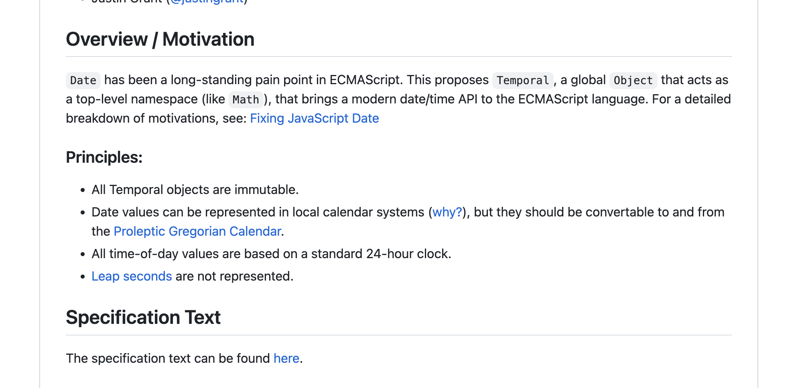
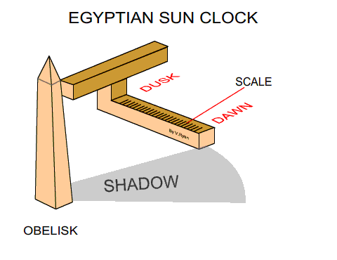
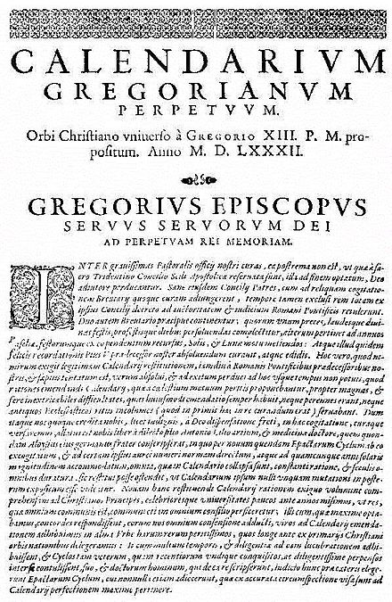
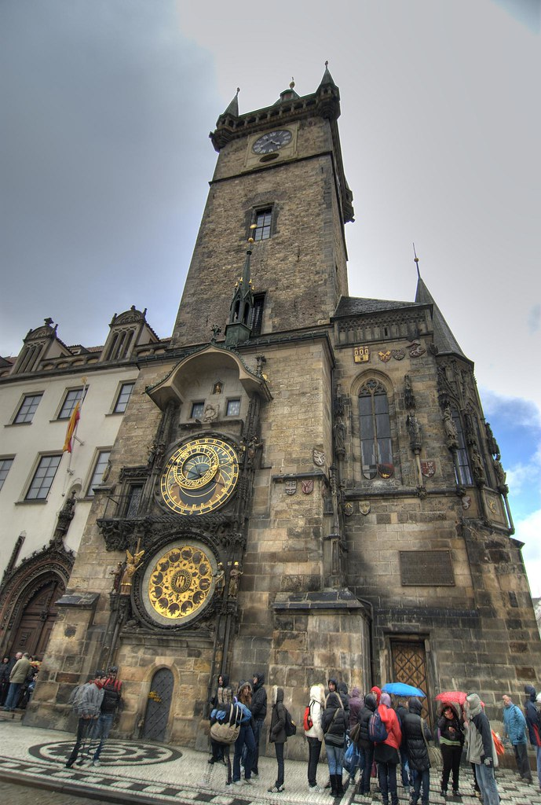
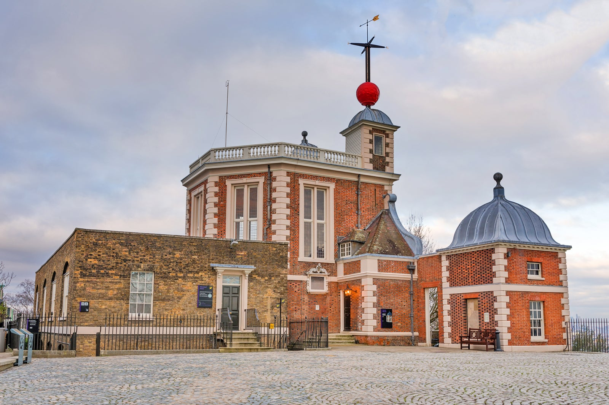

<style>
table {
  width: 100%;
  margin-top: 1rem;
  font-size: 29px;
}
table td {
  font-family: monospace;
}
</style>

# ¿Cómo se programa el tiempo?

#### [@iagolast](twitter.com/iagolast)

#### www.timetime.in

<!--

Hola, mi nombre es iago lastra. iagolast en Twitter, soy dearrollador frontend desde hace más de una década. Y desde hace un año soy también cofundador de timetime.in

Una empresa en la que nos dedicamos principalmente a desarrollar software relacionado con calendarios y reservas.

-->

---

# TEST

<!-- footer: "Devs & devs con problemas en fechas" -->

<!--

Antes de nada me gustaría hacer el tipico juego para captar vuestra atención.

¿Cuantas personas de esta sala sabeis programar? Levantaos.
Bien, de los que estáis de pié, levantad la mano si habeis tenido que lidiar con fechas y pensáis que ha sido una tarea difícil.

(Valorar métricas)

 -->

---

# Temporal



<!--

Por si no lo sabíais, el TC39, el grupo de expertos que decide la evolución de el lenguaje javascript, está trabajando en una nueva característica del lenguaje llamada "Temporal".

Entre los principios que guían esta propuesta podemos leer:

- Las fechas pueden ser representadas en calendarios locales pero deben ser convertíbles al calendario gregoriano.
- Todos los días estan basados en un reloj de 24 horas
- Los segundos intercalares no se representan.


¿Cuántos de vosotros entendeis estos principios?

Perfecto, pues el objetivo de esta charla es doble. Por una parte quiero dar una introducción a la historia del calendario, desde los calendarios lunares hasta los sistemas utilizados en los lenguajes de programación como javascript y por otra quiero daros una serie de nociones básicas y consejos para tratar con el tiempo y las fechas de la forma más adecuada posible en el contexto la programación.

---

-->

<!-- footer: '' -->

---

# El problema 🌍 ~ 🌞

<video style="margin:auto" controls width="700" height="480px">
  <source src="img/calendar.mp4" type="video/mp4">
</video>

<!-- footer: 'https://www.youtube.com/watch?v=nQgQoQqz4Nk' -->

---

# Calendar


<!--

Empecemos por el principio, el calendario. El calendario no es más que una herramienta que nos permite medir y organizar el paso del tiempo.

Como todas las herramientas, el calendario ha ido evolucionando a medida que cambian las necesidades y los problemas que tiene que resolver.

Para medir el tiempo tenemos que buscar un suceso periódico, es decir, uno que ocurre de forma regular y a intervalos conocidos y contar su número de ocurrencias.

Como todos sabreis, el sol sale cada día y la luna tiene un ciclo de aproximadamente 28 días y por ello los primeros humanos los empezaron a utilizar para medir el tiempo.

-->

<!-- footer: '' -->

---

# 🌞

Día solar (1)


<!--

En contra de lo que podáis pensar, un día no es el tiempo que tarda la tierra en dar una vuelta sobre si misma. (Eso se llama dia sideral).

Un día solar, es el tiempo que tarda la tierra en dar una vuelta sobre si misma más unos minutos para compensar el movimiento de translacción alrededor del sol.

 -->

---

# 🌔

Ciclo lunar (29.5)


<!-- Recordemos que estamos hablando de hace decenas de miles de años y que las matemáticas y las multiplicaciones no eran demasiado comunes, por lo que para hablar de ciclos más grandes se utilizaba el ciclo lunar. De aproximadamente 29 días y medio -->

---


<!-- Por lo que podemos imaginarnos conversaciones diciendo, "el río está a 3 soles caminando en esa dirección" o "la niña nacerá dentro de 9 lunas" -->

---


<!--

 Como imaginareis en esta época las matemáticas no estaban demasiado desarrolladas o sea que para medir tiempos "grandes" lo más común era utiliazr calendarios lunares.


Y los primeros calendarios de los que se tiene constancia eran puramente lunares.
 -->

---

# ~10.0000 BC

$\frac{365,2422 🌞}{29,5 🌝} = 12,38$


<!--

El problema de utilizar exclusivamente la luna como referente temporal es que se pierde totalmente la nocion de las estaciones.

Al tener meses de 29 días y medio, acumulamos un desfase de más de un tercio anual respecto al año solar.


De nuevo, para hablar de embarazos y de distancias caminando estos primeros calendarios son suficientes...

-->

---

# ~2000 AC

## 🌊 🌾 🌱


<!--

Pero cuando la supervivencia de tu civilización depende en gran parte de predecir correctamente el momento en el que un río va a tener mayor o menor caudal la cosa cambia.

Esto es lo que pasaba en el antiguo Egipto con el rio Nilo.
 -->

---

# ~2000 AC

## 🌔 + 🌞

- 12 months of 30 days
- Extra days (5)


<!--
Por todo esto los egipcios fueron una de las primeras civilizaciones en tener un calendario lunisolar capaz de predecir estaciones con bastante precisión.

Este calendario constaba de doce meses de 30 días a los que se le añadían algunos meses extra para compensar.

 -->

---



<!-- footer: "http://www.hartford-hwp.com/archives/21/004.html" -->

<!--

Los egipcios fueron tambien pioneros a la hora de dividir el día en partes más pequeñas.

Tenían diversos aparatos, como el reloj de sombra que veis aquí que permitía conocer en que momento del día nos encontrábamos con bastante precisión. De hecho algunos linguistas apuntan a que el origen de la palabra "hora" proviene de "Horus" el dios del cielo egipcio.


 -->

---


<!-- footer: '' -->

<!-- Como curiosidad decir que los egipcios, al igual que los sumerios contaban utilizando las falanges de los dedos, y por eso sus días se dividían en 12 horas. -->

---


<!-- Otro dato curioso es que el sentido de las agujas del reloj, es el que es porque es la dirección que tiene la sombra de un reloj de sol en el hemisferio norte. -->

---

# 45 AC

Julian calendar


<!--

Y con todo esto llegamos al año 45 antes de Cristo.

Seguramente os suene que Julio César

 -->

---

1. `Martius (31)`: Mes de Marte, dios de la guerra.
2. `Aprilis (30)`: (del verbo _aperire_) mes de la apertura de las flores.
3. `Maius (31)`: Mes de Maya.
4. `Junius (30)`: Mes de Juno (diosa del matrimonio).
5. `Quintilis (31)`: Quinto mes.
6. `Sextilis (30)`: Sexto mes.
7. `September (31)`: Séptimo mes.
8. `October (30)`: Octavo mes.
9. `November (31)`: Noveno mes.
10. `December (30)`: Décimo mes.
11. `Januarius (31)`: Mes de Jano, dios de los comienzos y los finales.
12. `Februarius (29)`: Mes de las hogueras y la purificación.

<!--

footer: 365.25 days ~ 365 + 366 days every 4 years

 -->

---

1. `Januarius (31)`: Month of Janus, god of beginnings and endings.
2. `Februarius (28)`: Month of bonfires and purification.
3. `Martius (31)`: Month of Mars, god of war.
4. `Aprilis (30)`: (from the verb _aperire_) month of flower opening.
5. `Maius (31)`: Month of Maia.
6. `Junius (30)`: Month of Juno (goddess of marriage).
7. `JULY (Quintilis) (31)`: Month of Julius Caesar.`
8. `AUGUST (Sextilis)(31)`: Month of Caesar Augustus.
9. `September (31)`: Seventh month.
10. `October (30)`: Eighth month.
11. `November (31)`: Ninth month.
12. `December (30)`: Tenth month.

<!-- footer: '' -->

---


---

1. `Dies Solis`: Día del Sol, dedicado al Sol.
2. `Dies Lunae`: Día de la Luna, dedicado a la Luna.
3. `Dies Martis`: Día de Marte, dedicado a Marte, dios de la guerra.
4. `Dies Mercurii`: Día de Mercurio, dedicado a Mercurio, el mensajero de los dioses y dios del comercio.
5. `Dies Iovis`: Día de Júpiter, dedicado a Júpiter, el rey de los dioses.
6. `Dies Veneris`: Día de Venus, dedicado a Venus, diosa del amor y la belleza.
7. `Dies Saturni`: Día de Saturno, dedicado a Saturno, dios de la agricultura.

<!--  -->

---

- `Minutum Primum`: Primera pequeña parte,
  - Referente al primer nivel de división de la hora.
- `Secundum Minutum`: Segunda pequeña parte
  - Indica el segundo nivel de división, esta vez del minuto.

---

# 1582

- Error of 10 days
- Gregorian Calendar



<!--

Pero volvamos al Calendario.

Como hemos dicho el calendario juliano acumulaba un error de unos 11 minutos al año. Y para 1532, este error suponía un atraso de 10 días.

Para la iglesia, era fundamental la regularidad del calendario litúrgico. Y una de las fiestas fundamentales era la pascua.

La pascua es el primer domingo de luna llena despues del equinocio de primavera.

Como por esa época los cristianos estaban celebrando sus fiestas 10 días tardes las otras religiones se cachondaban de ellos y esto hizo que el papa gregorio XII iniciase una reforma del calendario juliano que ahora conocemos como calendario Gregoriano.


  -->

---

# Summary

- **SOLAR YEAR:**
  - 365.2422 solar days.
- **JULIAN YEAR** (365 days + 1 leap day every 4 years)
  - 365.25 days. ~11 extra minutes each year
- **GREGORIAN YEAR** (365 days + 1 leap year every x years)
  - 365.2425 days. ~26 extra seconds each year

<!-- footer: https://www.youtube.com/watch?v=LO5cLQAvtXg -->

<!--
- https://www.youtube.com/watch?v=nQgQoQqz4Nk


Sin entrar en detalles esta reforma consistió en modificar las normas segun las cuales un año es bisiesto para ajustar la duración del año a la del año solar.
 -->

---

# Implicaciones

- Muerte de santa teresa
- Revolución de octubre

<!-- footer: "" -->

<!--

Ademas de eso se eliminaron 10 días de golpe. Por eso se santa teresa murio el 5 de octubre y la enterraron el 15 de octubre.

O la famosa revolución de octubre, fue en realidad en noviembre.

 -->

---

<!-- footer: "" -->



<!--

Pero con todo, por primera vez la humanidad tenia un calendario preciso con el que medir perfectamente años, meses dias y estaciones.

E incluso empezaron a construirse unos complejos mecanismos que permitían conocer la hora con una precisión más que aceptable incluso durante la noche.

-->

---

# 1830s

Se populariza el ferrocarril


<!--

Hasta que entramos en la primera mitad del siglo XIX y entra en escena el tren.

El tren cambia por completo la percepción del tiempo y por primera vez los minutos empiezan a ser relevantes a la hora de hablar de viajes.

Hasta entonces, cuando la gente se movía a pie o a caballo, ir de Madrid a Pontevedra era un viaje que llevaba "dias" nadie decia a que hora se llegaba.

Con el tren esto cambia totalmente y se empieza a hablar de la hora de llegada.

 -->

---


---

<!-- footer: https://www.youtube.com/watch?v=NFLb1IPlY_k -->


---

<!-- footer: "" -->


<!--

Ahora vamos a volver al colegio. Si un tren sale de Barcelona a las 12:00 y otro tren sale a las 12:30 de santiago de compostela. ¿A que hora se cruzan asumiendo a una velocidad constante de 100km/h ?

 -->

---


---

# PLOT TWIST!

---


---


---


---

# 1840

### 🚂 Tiempo estandar



<!--

In November 1840, the Great Western Railway company decided to standarize time all its stations and they decided to use the time indicated by the Royal Observatory in Greenwich.


 -->

---

# 1880

Unificación horaria en UK


<!--

It wasn't until 1880 when the entire United Kingdom adopted a standard time based on the railway schedule.

Despite it may seem normal today, there was much resistance, and in places like the Bristol Stock Exchange, you can still see a clock that has two hands, one showing the local time and the other showing GMT (Greenwich Mean Time).

 -->

---

# 1884

Se establece como referencia el meridiano de Greenwich.


<!--

In October 1884, the International Meridian Conference was held, where it was broadly agreed that "for technical matters," a reference time based on the mean time at the Greenwich Meridian (GMT) would be established.

The use of different time zones was proposed.


-->

---

# 1912

- Conferencia internacional del tiempo.
- Se establecen 24 zonas horarias.


<!--
In 1912, the International Time Conference was held in Paris with representatives from 25 nations. The time zone system presented at the 1884 conference was agreed upon, and the International Bureau of Time was established.
-->

---

# ~1948

Reloj atómico


<!--

And so we arrive at the 1950s, when the atomic clock is mature enough to initiate a new revolution in the way we measure time.

We now have a reference system that doesn't rely on the Earth's rotation but on the frequency of oscillation of an atom.

 -->

---

# ~1958

Tiempo atómico internacional (TAI)


<!--

This led physicists to replace astronomers in their role as guardians of time. And they created their own time scale, Universal Atomic Time.

Calculated from the frequency of oscillation of a series of atomic clocks distributed worldwide.

https://aviation.stackexchange.com/questions/90839/what-are-satellite-time-gps-time-and-utc-time

-->

---


<!--

So we have two mechanisms for measuring time.

One is astronomical time, based on the rotation of the Earth and the position of the stars. The other is atomic time, based on oscillation frequencies.
-->

---

# 1970

$UTC_{s} = TAI_{s} - L_{s}$

###### $L_{2024} = 37$


<!--
As the rotation of the Earth is not constant, in 1970 Coordinated Universal Time (UTC) was created.

Coordinated Universal Time is International Atomic Time plus an adjustment to compensate for these changes. This adjustment involves adding or subtracting the so-called leap seconds.

Therefore, UTC gradually deviates more and more from International Atomic Time.
-->

---

# Segundo intercalar (Leap second)

> Un ajuste que se le aplica a UTC para compensar la diferencia entre el tiempo atómico y el tiempo unviversal.

---

# Hoy

Diferentes sistemas horarios


<!-- footer: https://gssc.esa.int/navipedia/index.php/Transformations_between_Time_Systems -->

---

# Hoy II

## Sistemas de referencia temporales


<!-- footer: https://www.ucolick.org/~sla/leapsecs/timescales.html -->

---

# Tiempo POSIX

<!--

Of all the time scales, the one that concerns us as programmers is POSIX.

The POSIX system is the time system used by most modern operating systems. It is also the time system used by JavaScript.

POSIX is defined as "the number of seconds elapsed since January 1, 1970, at 00:00:00 UTC, excluding leap seconds".

POSIX is not intended to be precise; it is designed to make it simple to operate with dates by assuming that all days have a fixed duration.

-->

> The number of **non-leap seconds** which have passed since 00:00:00 UTC on Thursday, 1 January 1970

<!-- footer: 'https://en.wikipedia.org/wiki/Unix_time' -->

---

# KE PASA CON LOS LEAP SECONDS!?

- STEP
- SMEAR

<!-- footer: '' -->

---

# Stepping leap seconds

| UTC      | TAI      | UTC (s)   | POSIX (step) |
| -------- | -------- | --------- | ------------ |
| 23:59:58 | ......16 | 315619216 | 315619198.00 |

---

# Stepping leap seconds

| UTC      | TAI      | UTC (s)   | POSIX (step) |
| -------- | -------- | --------- | ------------ |
| 23:59:58 | ......16 | 315619216 | 315619198.00 |
| 23:59:59 | ......17 | 315619217 | 315619199.00 |

---

# Stepping leap seconds

| UTC          | TAI      | UTC (s)   | POSIX (step) |
| ------------ | -------- | --------- | ------------ |
| 23:59:58     | ......16 | 315619216 | 315619198.00 |
| 23:59:59     | ......17 | 315619217 | 315619199.00 |
| 23:59:**60** | ......18 | 315619218 | 315619199.00 |

---

# PROBLEM

- Same UNIX second represents 2 UTC times
- Logs can go back in time

| UTC        | TAI        | UTC (s)     | POSIX (step) |
| ---------- | ---------- | ----------- | ------------ |
| 23:59:58   | ......16   | 315619216   | 315619198.00 |
| 23:59:59.7 | ......17.7 | 315619217.7 | 315619199.70 |
| 23:59:60.2 | ......18.2 | 315619218.2 | 315619199.20 |

---

# Smearing

## Ralentizar el reloj

| UTC      | TAI      | UTC (s)   | POSIX (step) | POSIX (smear) |
| -------- | -------- | --------- | ------------ | ------------- |
| 23:59:58 | ......16 | 315619216 | 315619198.00 | 315619197.75  |

---

# Smearing

| UTC      | TAI      | UTC (s)   | POSIX (step) | POSIX (smear) |
| -------- | -------- | --------- | ------------ | ------------- |
| 23:59:58 | ......16 | 315619216 | 315619198.00 | 315619197.75  |
| 23:59:59 | ......17 | 315619217 | 315619199.00 | 315619198.50  |

---

# Smearing

| UTC          | TAI      | UTC (s)   | POSIX (step) | POSIX (smear) |
| ------------ | -------- | --------- | ------------ | ------------- |
| 23:59:58     | ......16 | 315619216 | 315619198.00 | 315619197.75  |
| 23:59:59     | ......17 | 315619217 | 315619199.00 | 315619198.50  |
| 23:59:**60** | ......18 | 315619218 | 315619199.00 | 315619199.25  |

---

# Smearing

| UTC          | TAI      | UTC (s)   | POSIX (step) | POSIX (smear) |
| ------------ | -------- | --------- | ------------ | ------------- |
| 23:59:58     | ......16 | 315619216 | 315619198.00 | 315619197.75  |
| 23:59:59     | ......17 | 315619217 | 315619199.00 | 315619198.50  |
| 23:59:**60** | ......18 | 315619218 | 315619199.00 | 315619199.25  |
| 00:00:00     | ......19 | 315619219 | 315619200.00 | 315619200.00  |

---

# Smearing

- (-) Los segundos no duran lo mismo.
- (+) No hay ambiguedad.

<!-- footer: "https://developers.google.com/time/smear" -->

---

## Habitualmente no necesitamos precisión de segundos...

---

# TIMEZONES 🫠

### Reventando tu software desde `undefined`


<!-- footer: 'https://www.youtube.com/watch?v=-5wpm-gesOY' -->

---

# Parte II: Software

- Fechas vs instantes
- Relación entre zona horaria, offset y UTC
- Las fechas deberían preservar la intención

<!-- footer: '' -->

---


---


<!-- footer: 'Instante' -->

---


<!-- footer: 'Fecha (dos instantes)' -->

---


<!-- footer: 'Fecha (dos instantes)' -->

---

```ts
/**
 * Values are interpreted in LOCAL TIME,
 */
const birthDate = new Date(1992, 09, 13);

/**
 * Internally this is just a timestamp
 */
date.getTime(); // 718930800000

/**
 * When we print ISO we get somethig different 🤯
 */
date.toISOString(); // '1992-10-12T23:00:00.000Z'
```

<!-- footer: '1) Dates are local. 2) Month starts in 0 ' -->

---

# UN TIMESTAMP PIERDE INFORMACIÓN

| Timestamp   | Spain A      | Australia        |
| ----------- | ------------ | ---------------- |
| 12345678910 | oct 13 10:00 | october 14 06:00 |

<!-- footer: 'The timestamp does not contain information about the original timezone.' -->

---

# LAS COSAS CLARAS

- Instante (Instant)
- Fecha (Date)
- Fecha y hora (DateTime)

<!-- footer: '' -->

---

# Milliseconds 👎

`12345667890877`

<!-- footer: 'Perdemos la fecha civil' -->

---

# UTC 👎

`2024-10-13T10:00:00Z`

<!-- footer: 'Es equivalente, perdemos la fecha civil' -->

---

# DateTime + Offset 👎

`2021-10-13T08:00:00+02:00`

<!-- footer: 'Seguimos perdiendo la fecha civil y es ambiguo' -->

---

# DateTime + Timezone 🤨

`2021-10-13T08:00:00[Europe/Madrid]`

<!-- footer: 'Ambiguo! El dia del cambio de hora se repiten' -->

---

# DateTime + Timezone II🤨

## Cambio de hora!

`2021-10-13T08:02:00+01:00[Europe/Madrid]`
`2021-10-13T08:02:00+02:00[Europe/Madrid]`

<!-- footer: 'Ambiguo! El dia del cambio de hora se repiten' -->

---

# Datetime + Offset + Timezone 👌

`2021-10-13T08:00:00+02:00[Europe/Madrid]`

<!-- footer: 'Este formato preserva toda la información 😊 ' -->

---

# READ MORE

[Temporal API](https://tc39.es/proposal-temporal/docs/)


## <!-- footer: '' -->

---

# Reto ⏰ + 🛫

> "El 31 de Marzo tengo que coger un vuelo a las 6 de la mañana."

---

# THANKS

## www.timetime.in

iago@timetime.in
[@iagolast](twitter.com/iagolast) 𝕏
